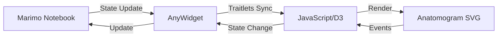

# Marimo Anatomogram Explorer - Implementation Plan

## Overview

This document outlines the plan for creating an interactive Marimo notebook with a native anatomogram visualization using AnyWidget. This approach provides a clean separation between Marimo controls and the D3.js visualization while enabling seamless integration.

## Architecture

### Directory Structure
```
/dna2cell-marimo/
├── anatomogram/                    # Existing visualization (reference only)
│   ├── src/
│   ├── data/
│   └── scripts/
├── notebooks/
│   └── anatomogram_explorer.py     # Main Marimo notebook
├── marimo_components/
│   ├── __init__.py
│   ├── anatomogram_widget.py      # AnyWidget implementation
│   ├── data_processor.py          # Data processing utilities
│   └── export_utils.py            # Export functionality
├── assets/                         # Static assets for the widget
│   └── svg/
│       ├── homo_sapiens.male.svg
│       └── homo_sapiens.female.svg
├── sample_data/                    # Additional sample datasets
│   ├── expression_example.csv
│   └── expression_example.json
└── MARIMO_NOTEBOOK_PLAN.md        # This file
```

### Update Strategy

The AnyWidget approach provides better modularity:
- **D3 visualization logic**: Encapsulated in the AnyWidget class
- **Marimo controls**: Native Marimo UI components
- **Data flow**: Direct state synchronization via traitlets
- **Assets**: SVG files served as static assets

## Implementation Phases

### Phase 1: Basic Integration (MVP)

**Goal**: Create a working Marimo notebook with native anatomogram visualization using AnyWidget

#### Components:
1. **AnyWidget Implementation** (`anatomogram_widget.py`)
   ```python
   class AnatomogramWidget(anywidget.AnyWidget):
       # Traitlets for state synchronization
       expression_data = traitlets.Dict({}).tag(sync=True)
       selected_gene = traitlets.Unicode("").tag(sync=True)
       sex = traitlets.Unicode("male").tag(sync=True)
       color_palette = traitlets.Unicode("viridis").tag(sync=True)
       scale_type = traitlets.Unicode("linear").tag(sync=True)
       uberon_map = traitlets.Dict({}).tag(sync=True)
       
       # D3.js visualization code
       _esm = "..." # D3 implementation
       _css = "..." # Styles from existing CSS
   ```

2. **Data Processing** (`data_processor.py`)
   ```python
   class ExpressionDataProcessor:
       def load_json(self, file_content: bytes) -> dict
       def load_csv(self, file_content: bytes) -> dict
       def validate_format(self, data: dict) -> tuple[bool, str]
       def get_gene_list(self, data: dict) -> list[str]
       def get_tissue_list(self, data: dict) -> set[str]
       def normalize_values(self, data: dict) -> dict
   ```

3. **Marimo Notebook** (`anatomogram_explorer.py`)
   - File upload interface for expression data
   - Native Marimo controls (dropdowns, sliders)
   - AnyWidget anatomogram display
   - Reactive updates on control changes

#### Deliverables:
- Working AnyWidget with D3 anatomogram visualization
- Native Marimo controls for all parameters
- Seamless reactive updates

### Phase 2: Enhanced Interactivity

**Goal**: Add rich interactive features and data analysis

#### New Features:
1. **Advanced Controls**
   - Expression threshold slider
   - Multi-gene selection for comparison
   - Tissue filtering
   - Search functionality

2. **Statistical Analysis**
   - Expression distribution plots
   - Top/bottom expressed tissues
   - Gene correlation analysis
   - Tissue clustering

3. **Visualization Enhancements**
   - Side-by-side gene comparison
   - Differential expression view
   - Time-series support (if applicable)

#### Code Structure:
```python
# In anatomogram_explorer.py

# Cell: Advanced Controls
threshold_slider = mo.ui.slider(0, 1, 0.01, label="Expression Threshold")
tissue_filter = mo.ui.multiselect(tissue_list, label="Filter Tissues")
gene_search = mo.ui.text(placeholder="Search genes...")

# Cell: Statistical Analysis
def analyze_expression(data, gene, threshold):
    """Generate statistical summary"""
    stats = {
        'mean': np.mean(values),
        'std': np.std(values),
        'top_tissues': get_top_tissues(data, gene, n=10),
        'distribution': create_distribution_plot(data, gene)
    }
    return stats

# Cell: Comparative Analysis
def compare_genes(data, genes):
    """Create comparative visualizations"""
    heatmap = create_expression_heatmap(data, genes)
    correlation = calculate_gene_correlation(data, genes)
    return heatmap, correlation
```

### Phase 3: Advanced Features

**Goal**: Production-ready features for research workflows

#### Features:
1. **Data Import/Export**
   - Support multiple file formats (H5AD, MTX, etc.)
   - Batch processing
   - Export processed data
   - Save/load sessions

2. **Integration Features**
   - Connect to external databases
   - API endpoints for programmatic access
   - Jupyter notebook export
   - Static HTML generation

3. **Collaboration**
   - Shareable links
   - Comments/annotations
   - Version tracking
   - Multi-user sessions

## Technical Implementation Details

### Communication Architecture



### Data Flow

1. **Upload**: User uploads expression data to Marimo
2. **Process**: Marimo validates and processes data  
3. **Update Widget**: Set widget properties via traitlets
4. **Render**: D3.js renders the anatomogram
5. **Interact**: User interactions update widget state
6. **Analyze**: Perform statistical analysis in Marimo
7. **Export**: Save results and visualizations

### Code Examples

#### AnyWidget Implementation
```python
import anywidget
import traitlets
from pathlib import Path

class AnatomogramWidget(anywidget.AnyWidget):
    # Load CSS from existing file
    _css = Path("anatomogram/src/css/style.css").read_text()
    
    # JavaScript implementation with D3
    _esm = """
    import * as d3 from "https://cdn.skypack.dev/d3@7";
    
    function render({ model, el }) {
        const container = d3.select(el)
            .append("div")
            .attr("class", "anatomogram-container");
        
        let currentSvg = null;
        let tooltip = null;
        
        // Initialize tooltip
        function initTooltip() {
            tooltip = d3.select(el)
                .append("div")
                .attr("class", "tooltip")
                .style("display", "none");
        }
        
        // Load SVG based on sex
        async function loadAnatomogram() {
            const sex = model.get("sex");
            const baseUrl = model.get("base_url") || "";
            const svgPath = `${baseUrl}/assets/svg/homo_sapiens.${sex}.svg`;
            
            try {
                const svgDoc = await d3.xml(svgPath);
                container.node().innerHTML = '';
                const svgElement = svgDoc.documentElement;
                container.node().appendChild(svgElement);
                currentSvg = d3.select(svgElement);
                
                // Attach event handlers
                attachEventHandlers();
                updateColors();
            } catch (error) {
                console.error("Error loading SVG:", error);
            }
        }
        
        // Color scale creation (from existing code)
        function createColorScale(palette, scaleType) {
            const colorSchemes = {
                'viridis': d3.interpolateViridis,
                'magma': d3.interpolateMagma,
                'inferno': d3.interpolateInferno,
                'plasma': d3.interpolatePlasma,
                'turbo': d3.interpolateTurbo
            };
            
            const interpolator = colorSchemes[palette] || d3.interpolateViridis;
            
            if (scaleType === 'log') {
                return d3.scaleSequential()
                    .domain([0.001, 1])
                    .interpolator(interpolator)
                    .clamp(true);
            } else {
                return d3.scaleSequential()
                    .domain([0, 1])
                    .interpolator(interpolator);
            }
        }
        
        // Update tissue colors
        function updateColors() {
            if (!currentSvg) return;
            
            const gene = model.get("selected_gene");
            const expressionData = model.get("expression_data");
            const palette = model.get("color_palette");
            const scaleType = model.get("scale_type");
            const threshold = model.get("threshold") || 0;
            
            const colorScale = createColorScale(palette, scaleType);
            
            // Update all tissue paths
            currentSvg.selectAll('path').each(function() {
                const tissueId = d3.select(this).attr('id');
                if (tissueId && tissueId.startsWith('UBERON')) {
                    const value = expressionData?.genes?.[gene]?.[tissueId] || 0;
                    const color = value >= threshold ? colorScale(value) : '#E0E0E0';
                    d3.select(this).style('fill', color);
                }
            });
        }
        
        // Attach event handlers for tooltips
        function attachEventHandlers() {
            if (!currentSvg || !tooltip) return;
            
            currentSvg.selectAll('path').on('mouseover', function(event) {
                const tissueId = d3.select(this).attr('id');
                if (!tissueId || !tissueId.startsWith('UBERON')) return;
                
                const gene = model.get("selected_gene");
                const expressionData = model.get("expression_data");
                const uberonMap = model.get("uberon_map");
                
                const value = expressionData?.genes?.[gene]?.[tissueId] || 0;
                const tissueName = uberonMap?.[tissueId] || tissueId;
                
                tooltip
                    .style("display", "block")
                    .html(`<strong>${tissueName}</strong><br>Expression: ${value.toFixed(3)}`);
            })
            .on('mousemove', function(event) {
                tooltip
                    .style("left", (event.pageX + 10) + "px")
                    .style("top", (event.pageY - 10) + "px");
            })
            .on('mouseout', function() {
                tooltip.style("display", "none");
            });
        }
        
        // Initialize
        initTooltip();
        loadAnatomogram();
        
        // Listen for property changes
        model.on("change:selected_gene", updateColors);
        model.on("change:sex", loadAnatomogram);
        model.on("change:color_palette", updateColors);
        model.on("change:scale_type", updateColors);
        model.on("change:threshold", updateColors);
        model.on("change:expression_data", () => {
            loadAnatomogram();
        });
    }
    
    export default { render };
    """
    
    # Synchronized properties
    expression_data = traitlets.Dict({}).tag(sync=True)
    selected_gene = traitlets.Unicode("").tag(sync=True)
    sex = traitlets.Unicode("male").tag(sync=True)
    color_palette = traitlets.Unicode("viridis").tag(sync=True)
    scale_type = traitlets.Unicode("linear").tag(sync=True)
    uberon_map = traitlets.Dict({}).tag(sync=True)
    threshold = traitlets.Float(0.0).tag(sync=True)
    base_url = traitlets.Unicode("").tag(sync=True)
```

#### Using the Widget in Marimo
```python
# In anatomogram_explorer.py
import marimo as mo
from marimo_components.anatomogram_widget import AnatomogramWidget
from marimo_components.data_processor import ExpressionDataProcessor

# Create widget instance
anatomogram = AnatomogramWidget()

# Create Marimo controls
gene_selector = mo.ui.dropdown(
    options=gene_list,
    value=gene_list[0] if gene_list else None,
    label="Select Gene"
)

sex_selector = mo.ui.radio(
    options=["male", "female"],
    value="male",
    label="Anatomogram View"
)

# Create the bound widget
widget_ui = mo.ui.anywidget(
    anatomogram,
    selected_gene=gene_selector.value,
    sex=sex_selector.value,
    expression_data=processed_data,
    # ... other bindings
)

# Display controls and widget
mo.vstack([
    mo.hstack([gene_selector, sex_selector]),
    widget_ui
])
```

#### Data Processing Pipeline
```python
def process_uploaded_file(file_upload):
    """Process uploaded expression data file"""
    if not file_upload.value:
        return None, "No file uploaded"
    
    file_info = file_upload.value[0]
    content = file_info.content
    filename = file_info.name
    
    processor = ExpressionDataProcessor()
    
    try:
        if filename.endswith('.json'):
            data = processor.load_json(content)
        elif filename.endswith('.csv'):
            data = processor.load_csv(content)
        else:
            return None, f"Unsupported file type: {filename}"
        
        # Validate data format
        is_valid, message = processor.validate_format(data)
        if not is_valid:
            return None, message
        
        # Extract metadata
        metadata = {
            'genes': processor.get_gene_list(data),
            'tissues': processor.get_tissue_list(data),
            'total_genes': len(data.get('genes', {})),
            'total_tissues': len(processor.get_tissue_list(data))
        }
        
        return data, metadata
        
    except Exception as e:
        return None, f"Error processing file: {str(e)}"
```

## Benefits of AnyWidget Approach

1. **Native Integration**: Direct state synchronization between Marimo and D3
2. **No Server Required**: Eliminates subprocess management complexity
3. **Better Performance**: No network overhead, instant updates
4. **Clean Architecture**: Controls in Marimo, visualization in AnyWidget
5. **Reactive Updates**: Automatic re-rendering on state changes
6. **Simplified Deployment**: Single Python package, no external dependencies

## Migration from Existing Visualization

The existing anatomogram code can be migrated to AnyWidget with minimal changes:

1. **CSS**: Direct copy from `style.css` to `_css` property
2. **D3 Logic**: Extract core rendering functions from `main.js`
3. **SVG Assets**: Copy to `assets/` directory
4. **Data Format**: Keep the same JSON structure

## Next Steps

1. **Review and Approval**: Confirm AnyWidget approach meets requirements
2. **Asset Migration**: Copy SVG files and extract D3 code
3. **Phase 1 Implementation**: Create AnyWidget and basic notebook
4. **Testing**: Validate with existing sample data
5. **Documentation**: Create user guide with examples
6. **Package**: Create installable package with dependencies

## Technical Considerations

1. **SVG Loading**: Need to serve SVG files as static assets
   - Option 1: Bundle SVGs as base64 in widget
   - Option 2: Serve from local directory
   - Option 3: Use CDN for SVG hosting

2. **Large Datasets**: For performance with many genes/tissues
   - Implement virtual scrolling for gene lists
   - Use WebGL rendering for very large anatomograms
   - Add data pagination options

3. **Browser Compatibility**: Ensure D3.js v7 works across browsers

## Example Usage

```python
# Install dependencies
pip install marimo anywidget pandas numpy

# Start Marimo notebook
marimo edit notebooks/anatomogram_explorer.py

# In the notebook:
1. Upload expression data (JSON/CSV)
2. Use native Marimo controls to select parameters
3. View anatomogram with real-time updates
4. Analyze expression patterns with integrated tools
5. Export visualizations and processed data
```

## Conclusion

The AnyWidget approach provides a cleaner, more maintainable solution that aligns perfectly with the goal of separating controls (in Marimo) from visualization (in D3). This architecture enables seamless integration while preserving the flexibility to enhance both components independently.